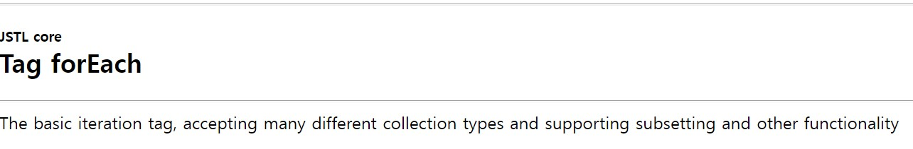
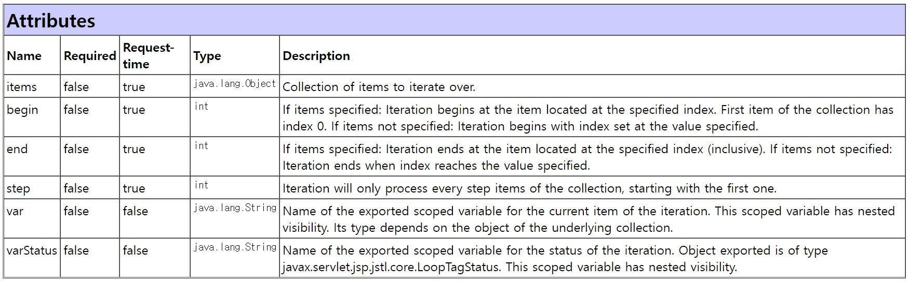
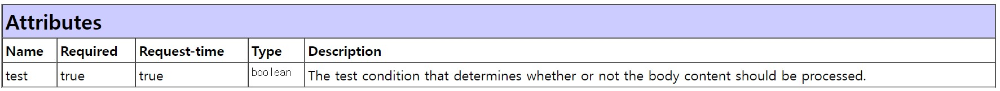

# #1 jstl

[01]  JSTL(JSP Standard TAG Library)의 사용 
 \- 많이 사용되는 사용자 정의 태그를 모아서 JSTL 규약 생성
 \- 스크립틀릿, 표현식을 보다 훨씬 간결한 문법 구조 지원 
 \- JSTL은 5가지의 태그를 지원 
 \- jstl API (http://java.sun.com/products/jsp/jstl/1.1/docs/tlddocs/index.html) 

라이브러리   기능            접두어   관련 URL 

\--------------------------------------------------------------------------------------- 

Core     변수지원,흐름제어,URL   c   http://java.sun.com/jsp/jstl/core ★ 

함수      콜렉션 처리, String     fn   http://java.sun.com/jsp/jstl/functions ★ 

 

1. Spring 컨테이너는 관련 모듈을 제공한다. 

(1) Core Tag 

기능    태그명    기능설명 

\--------------------------------------------------------------------------- 

변수 지원  set      jsp에서 사용될 변수를 설정 

​        remove   설정한 변수를 제거 

\--------------------------------------------------------------------------- 

흐름 제어  if      조건에 따라 내부 코드를 수행. 

​        choose   다중 조건을 처리할 때 사용

​        forEach   Collection의 각 항목을 처리할 때 사용

​        forTokens 구분자로 분리된 각각의 토큰을 처리할 때 사용

\--------------------------------------------------------------------------- 

URL 처리  import   URL을 사용하여 다른 자원의 결과를 삽입

​        redirect   지정한 경로로 이동

​        url      URL을 재 작성

\--------------------------------------------------------------------------- 

기타 태그  catch    예외 처리에 사용

​        out      jspWriter에 내용을 알맞게 처리한 후 출력

\--------------------------------------------------------------------------- 

 

# #2 jstl Tag

