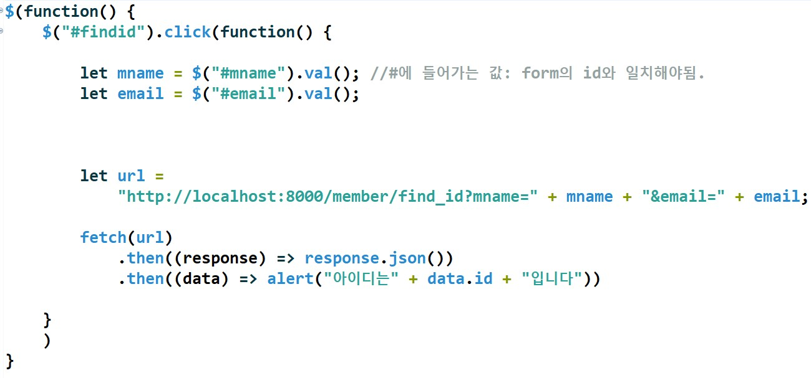

# 쇼핑몰 구현 프로젝트 

## Day1

### -오류 정리

**(케이스1)** tiles 파일에서 공통 템플릿이 적용이 안되는 경우 

 

*Controller 파일

  

*xml 파일

```
위의 코드는 오류 해결 이후의 코드

: xml의 definition name과 controller의 return값이 일치해야 한다.
GetMapping의 url과 return값이 동일해야 한다고 착각해서 값을 잘못 적었었는데 
GetMapping의 url값은 브라우저의 요청을 받아 mapping해올 경로를 나타내는 것이고, 
return값은 view화면, 즉 jsp의 경로를 의미한다. 
결국 xml의 definition name을 명시하는 이유도 jsp에 템플릿을 적용시키기 위해서이므로
Controller의 return값과 동일해야 함을 알 수 있었다. 
위의 코드는 오류 해결 이후의 코드
```


 **(케이스2)** 비동기 통신 오류 


```
: 우선 자바스크립트 문법에 익숙치 않아서 간간이 문법적인 오류를 발생시키기도 했다. 
 하지만 이에 앞서 fetch로 데이터를 받아올 때 
 Controller에서 리턴해준 데이터 값을 받아와야 하기 때문에
 GetMapping의 url경로를 통해 데이터를 받아와준다고 생각하고 
 ResponseBody객체에 저장된 dto를 response로 받아와서 json(javascript object annotation)화 해주고
 data로 변화된 값을 속성값을 찍어서 간편하게 받아오면 된다. 
 url에 들어가는 manme과 email은 변수를 생성, 즉 저장공간을 만들어 값을 받아와야 한다. 
```



```
위의 코드는 오류 해결 이후의 코드! 
```

## Day2

**(케이스1)**

 


```
 <div class= "caption">
  	<button type=button class="btn btn-default" 
  	onclick="location.href='updateFile?oldfile=${dto.fname}'">사진수정</button>
  </div>
  
  onclick="location.href='updateFile?oldfile=${dto.fname}'"
  이 코드를 작성하지 않아 사진이 뜨지 않았다.
  저장한 사진을 가져와주어야 함
```

